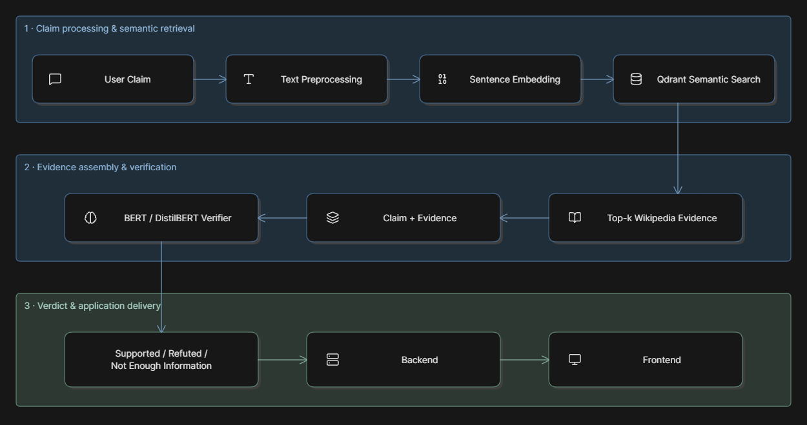

# News Credibility Checker

[](https://www.python.org/)
[](https://numpy.org/)
[](https://pandas.pydata.org/)

[](https://nextjs.org/)
[](https://fastapi.tiangolo.com/)
[](https://docs.astral.sh/uv/)
[](https://jupyter.org/)

An NLP-based claim verification system that determines whether a claim is Supported, Refuted, or Not Enough Information using relevant evidence.

---

## Course Name
CSE299 (Junior Design) under Muhammad Shafayat Oshman (MUO)

## Problem Statement

### What problems are we trying to solve?
Traditional fake-news classifiers mainly learn patterns from historical labeled data, so they may struggle with new or changing facts. Our system aims to verify a claim by retrieving relevant evidence and comparing it with the claim.

Example:
> “Lionel Messi is the prime minister of Bangladesh.”

The system should retrieve evidence about the prime minister of Bangladesh and classify the claim as REFUTED rather than relying only on patterns learned during training.

### Why is it important?
False and misleading information spreads rapidly through news sites and social media. Automated claim verification can assist users, journalists, researchers, and content moderators in checking questionable information.

### Real-World Applications
- News and social-media fact checking
- Fact-checking assistance for journalists
- Content moderation and misinformation detection
- Verification of public-information claims

## Dataset

### Source
**FEVER (Fact Extraction and VERification)** — [FEVER Dataset](https://fever.ai/dataset/fever.html)

- **Samples:** 185,445 claims
- **Main fields:** `id`, `claim`, `label`, `evidence`
- **Labels:** `SUPPORTS`, `REFUTES`, `NOT ENOUGH INFO`
- **Evidence source:** Wikipedia

### Key Features
| Feature | Description |
|---|---|
| `claim` | Textual statement to verify |
| `evidence` | Wikipedia sentences supporting or contradicting the claim |
| `label` | Verification target |
| `id` | Unique claim identifier |

### Wikipedia Corpus
The FEVER project also provides the pre-processed Wikipedia pages used by the dataset (June 2017 dump). No separate dataset with matching columns is required.

We convert the corpus into records such as:

```text
page_title
sentence_id
sentence_text
source_url
```

These records are embedded and stored in Qdrant for retrieval.

### Challenges
- Different wording between claims and evidence
- Entity ambiguity
- Negation and contradiction
- Dates and numerical information
- Multi-hop reasoning
- Irrelevant retrieved evidence
- Limited freshness of a historical Wikipedia corpus

## Data preprocessing

### Missing Values
- Remove records with missing claims or labels.
- Preserve missing evidence for `NOT ENOUGH INFO` cases where appropriate.
- Validate evidence references.

### Data Cleaning
- Normalize whitespace and text formatting.
- Remove unusable or empty records.
- Check duplicate records and invalid labels.
- Segment evidence into sentences where required.

### Feature Engineering
For the baseline:
- TF-IDF vectors
- Optional simple features such as claim length, evidence length, and word overlap  

For the transformer:
- Tokenized claim + evidence pairs
- No heavy manual feature engineering

For the retrieval pipeline
- Sentence embeddings for semantic similarity search
- Qdrant collection from sentence embeddings

### Data splitting
Use stratified train, validation, and test sets. Preprocessing and feature fitting must be performed using training data only to avoid data leakage. A separate unseen/real-world test set may also be used for stronger evaluation.

## Machine Learning Models

### Baseline: TF-IDF + Logistic Regression
Chosen because it is simple, fast, interpretable, and provides a useful baseline for comparison.

### Main verifier: BERT / DistilBERT
Input:

```text
[CLAIM] + [EVIDENCE]
```

Output:

```text
SUPPORTS / REFUTES / NOT ENOUGH INFO
```

A transformer is used because the task depends on semantic relationships between the claim and evidence, not only keyword frequency.

### Evidence Retrieval: Sentence Transformer + Qdrant
A sentence-embedding model converts the claim and Wikipedia sentences into vectors. Qdrant stores and searches these vectors to retrieve semantically relevant evidence.

## Training the model

### Verification task

```text
(claim, evidence) → SUPPORTS / REFUTES / NOT ENOUGH INFO
```

The transformer will be trained using supervised multi-class classification. Hyperparameters will be tuned on the validation set, and the best model will be evaluated only on the test set.

### Evaluation Metrics
- Accuracy
- Precision
- Recall
- F1-score
- Confusion matrix
- Evidence retrieval performance (Top-k)

The project targets approximately 85–90%+ performance on the selected benchmark, while separately evaluating generalization to unseen claims. End-to-end performance depends on both evidence retrieval and claim classification.

## Final application

### Backend — FastAPI
Responsible for:
- receiving the claim
- generating embeddings
- querying Qdrant
- running the verifier
- returning the verdict, confidence, and evidence

Example endpoint:

```http
POST /verify
```

### Frontend — Next.js
Provides:
- claim input
- verification button
- verdict display
- confidence score
- supporting/refuting evidence
- source information

This keeps the ML system in Python while using the JavaScript/Next.js stack for the final user-facing application.

## End to end pipeline 



## Evaluation

Evaluate both:

1. Verifier performance: claim + known evidence → predicted label.
2. End-to-end performance: claim → retrieval → verification → final label.

The target is 85–90%+ performance where achievable (hope to achieve even more than that but then again, lets see), while reporting retrieval and verification errors separately rather than relying only on overall accuracy.

A small manually verified unseen-claim test set can also be created to check real-world generalization.

---

## Conclusion

The project focuses on evidence-based claim verification rather than simply predicting whether text looks fake. By combining NLP preprocessing, classical ML, transformer-based verification, and semantic evidence retrieval, the system can provide a verdict together with supporting evidence. The initial system will use FEVER and Wikipedia for reproducibility, with the possibility of extending the retrieval layer to fresher web or news sources in future work.

## References

- [FEVER Dataset](https://fever.ai/dataset/fever.html)
- [Qdrant Documentation](https://qdrant.tech/documentation/)

